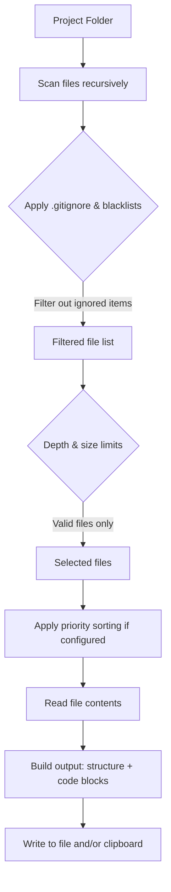

# Code Export For AI


Tool to export any project folder or repository into a single, neatly formatted file — ideal for quick AI-assisted code review, debugging and refactoring. The script collects source files recursively, wraps each file in fenced code blocks with relative paths, filters common noise (e.g. `node_modules`, `.git`, images), and produces a paste-ready output or copies it to the clipboard.

## Why use Code Export For AI
- Prepare full project context for AI quickly: paste the entire codebase into ChatGPT/Claude without manual copying.
- Fast code review and debugging: get a consolidated snapshot to ask focused questions about structure, bugs or refactoring.
- Share reproducible context: include relative paths and file order so AI or reviewers can follow the codebase layout.
- Filter and reduce noise: automatically ignore large binaries, images and common vendor folders to keep the export relevant.

## Table of Contents

- [Why use Code Export For AI](#why-use-code-export-for-ai)
- [Typical use cases](#typical-use-cases)
- [Features](#features)
- [Prerequisites](#prerequisites)
- [Installation / Requirements](#installation--requirements)
- [Quickstart](#quickstart)
  - [CLI Reference](#cli-reference)
- [Sample output](#sample-output)
- [How It Works](#how-it-works)
- [Configuration](#configuration)
- [Advanced Usage & Tips](#advanced-usage--tips)
  - [Priority file ordering](#priority-file-ordering)
  - [Configuration inheritance](#configuration-inheritance)
  - [Disabling update notifications](#disabling-update-notifications)
  - [Re‑export loop details](#re-export-loop-details)
- [Contributing](#contributing)

## Typical use cases
- Code review and refactoring requests to AI assistants (send whole project context in one paste).
- Pair-programming / debugging sessions where you need to show multiple files at once.
- Student help and tutoring: submit a full assignment for constructive feedback.
- Quick repository snapshots for onboarding, audits or issue reproduction.

## Features
- Recursively scans a directory and collects source files.
- **Multiple configuration profiles** – place `.py` config files in the `configs/` folder (or any subdirectory) and select one at startup. Each config can include a short description (`CONFIG_DESCRIPTION`) shown in the selection menu.
- Configurable ignore rules for directories, filenames and extensions (per configuration).
- Filename filtering with exact or partial matching (`FILENAME_FILTER_MODE`).
- **.gitignore integration** – automatically respect `.gitignore` rules when `USE_GITIGNORE = True` (reads the `.gitignore` located in the project root).
- **Depth limit** – restrict recursion depth with `MAX_DEPTH` (useful for large monorepos).
- Whitelist for extensionless files (e.g., `Dockerfile`, `Makefile`).
- Export project directory structure (ASCII tree) and file contents separately.
- Option to show empty directories in the structure (`SHOW_EMPTY_DIRS`) and include empty files (only in structure, no code block, `INCLUDE_EMPTY_FILES`).
- Save output to a file and/or copy to the clipboard.
- Clipboard safety limit to avoid pasting huge amounts of text accidentally.
- **Progress bar** during file scanning.
- **Extended statistics**: file tree, token estimate, summary of skipped files (binary/unreadable, too large, excluded by rules), top file extensions, and the 5 largest files included.
- **Priority-based file ordering** – define `PRIORITY_PATTERNS` and `LOW_PRIORITY_PATTERNS` to control the order of files in the output.
- **Update check** – on startup, can query GitHub for newer releases (configurable in `app_config.py`).
- **Interactive re‑export loop** – after an export, press Enter to run again with the same config (hot‑reloading edits), enter a number to switch to a different configuration, or `N` to exit.
- Works with CLI or GUI folder picker (Tkinter).

## Prerequisites
- **Python 3.10** or higher.
- **Required packages** (automatically installed, see Installation):
  - `rich` – coloured console output and progress bar.
  - `tiktoken` – token count estimation in statistics (uses `o200k_base` encoding).
  - `pathspec` – parsing `.gitignore` patterns.
  - `pyperclip` – reliable cross‑platform clipboard support (fallback to native utilities if missing).
- **Linux only**: If `pyperclip` is unavailable, at least one of `xclip` or `xsel` must be installed for clipboard support.

## Installation / Requirements
1. Clone the repository or download the source.
2. Install the required dependencies:

```powershell
# install from project's requirements.txt
pip install -r requirements.txt
```

Or install manually (not recommended if you want the full feature set):

```powershell
pip install rich tiktoken pathspec pyperclip
```

## Quickstart
1. Open a terminal in the `Code Export For AI` folder.
2. Run:

```powershell
python main.py
```

Or provide a folder, output file, and configuration directly:

```powershell
python main.py -d "C:\path\to\project" -o export.txt -c python
```

- `-d, --directory` – path to project folder (if omitted, a GUI folder picker opens).
- `-o, --output` – output filename (relative to `OUTPUT_DIR/config_name/`; if not given, the default name from configuration is used with an automatic sequential suffix).
- `-c, --config` – name of a configuration file from the `configs/` folder (e.g., `python` for `configs/python.py`). If the file is not found, `.py` is appended automatically. You may also provide an absolute path or a path relative to the current working directory. If omitted, the tool will:
  - automatically use the only config if exactly one `.py` file exists in `configs/` (including subdirectories),
  - show a tree‑style numbered selection menu (including config descriptions) if multiple configs are present,
  - fall back to `config.py` in the project root if `configs/` is empty.

### CLI Reference
| Argument | Short | Description |
|----------|-------|-------------|
| `--directory` | `-d` | Path to the project directory to export. If not provided, a graphical folder picker opens (falls back to console input if GUI is unavailable). |
| `--output` | `-o` | Output file path. Relative paths are resolved inside the effective output directory (`OUTPUT_DIR/config_name/`). If omitted, the default name from the configuration is used and a unique suffix (e.g. `_1`, `_2`) is appended to avoid overwriting. |
| `--config` | `-c` | Name of the configuration file to use. Accepts a filename relative to `configs/` (e.g., `python` → `configs/python.py`), an absolute path, or a path relative to the current working directory. If the name has no `.py` extension and is not found, `.py` is appended automatically. When not specified, the tool automatically selects or prompts for a configuration (see above). |

Clipboard support is cross-platform: the tool uses `pyperclip` when available, otherwise falls back to native utilities (`clip`, `pbcopy`, `xclip`/`xsel`).

## Sample output
Each file is exported with a relative path header followed by a fenced code block. Example:

````
src/main.py:
```python
def hello():
    print("Hello World")
```
````

````
components/button.js:
```javascript
function Button() {
    return <button>Click me</button>
}
```
````

If `EXPORT_STRUCTURE` is enabled (default), the output begins with a project directory tree, followed by the file contents:

````
```
# Project Directory Structure:
myproject/
├── src/
│   ├── main.py
│   └── utils/
│       └── helpers.py
└── README.md

# BEGIN FILE CONTENTS

src/main.py:
```python
def main():
    print("Hello")
```
````

When `INCLUDE_EMPTY_FILES` is enabled (default), empty files are shown in the structure but have no code block. When `SHOW_EMPTY_DIRS` is enabled, empty directories are also shown.

## How It Works



1. **Scanning**: The directory is walked recursively, skipping blacklisted directories, hidden files, and items matched by `.gitignore` (if enabled). The depth limit is enforced during traversal.
2. **Filtering**: Files are checked against extension blacklists, filename blacklists (exact or partial), size limits, and the extensionless whitelist. A progress bar shows the scanning progress.
3. **Sorting**: If `PRIORITY_PATTERNS` are defined, files are reordered according to the priority tiers; within each tier they are sorted by directory depth and alphabetically.
4. **Content reading**: Each remaining file is read with automatic encoding detection (UTF‑8, CP1251, Latin‑1). Binary/unreadable files are skipped.
5. **Output assembly**: An ASCII tree of the project structure is generated (optionally including empty directories), followed by all file contents wrapped in language‑detected fenced code blocks.
6. **Delivery**: The final string is written to the output file and/or copied to the clipboard (respecting the clipboard character limit).

## Configuration
The script expects configuration files inside the `configs/` folder (or a legacy `config.py` in the project root). Copy the example `config.py` from the repository into `configs/` and adjust it as needed. You can maintain multiple profiles (e.g., `python.py`, `frontend.py`) and organise them into subdirectories for grouping (e.g., `configs/backend/python.py`). The selection menu displays a tree with continuous numbering, showing the relative path (without `.py`) and the optional `CONFIG_DESCRIPTION`.

**Output location logic:** The final output is saved in a subdirectory named after the configuration file (without `.py`) inside `OUTPUT_DIR`. For example, if `OUTPUT_DIR = "outputs"` and you use `python.py`, files will be placed in `outputs/python/`. The filename derives from `OUTPUT_FILENAME` (or the `-o` argument) and may receive a sequential number to prevent overwrites when running repeatedly.

**Configuration description:**  
You can add a brief one‑line description to any config file by defining `CONFIG_DESCRIPTION` (e.g., `"Python-only backend project"`). It will appear next to the config name in the interactive selection tree.

Key options (inside a `.py` config file):

| Setting | Default | Description |
|---------|---------|-------------|
| `BLACKLIST_EXTENSIONS` | `{"txt", "md", "markdown", "log", "pdf", …}` (see template) | File extensions to ignore (without dot). |
| `ALLOWED_EXTENSIONLESS_FILES` | `{"Dockerfile", "Makefile", "README", "LICENSE"}` | Filenames without extension that should be included. |
| `BLACKLIST_DIRS` | `{"__pycache__", ".git", ".vscode", "node_modules", …}` | Directories to skip (names, not paths). |
| `BLACKLIST_FILENAMES` | `{"setup.py", "requirements.txt"}` | Specific filenames to ignore. |
| `FILENAME_FILTER_MODE` | `"exact"` | Matching mode for `BLACKLIST_FILENAMES`: `"exact"` or `"contains"`. |
| `USE_GITIGNORE` | `True` | If `True`, also respect `.gitignore` rules in addition to blacklists. The `.gitignore` file must be in the root of the exported project. **Note:** if the setting is absent from the config, it defaults to `False`; the supplied template sets it to `True`. |
| `MAX_DEPTH` | `-1` | Maximum recursion depth: `-1` = unlimited, `0` = only selected directory, positive integer = max depth. |
| `OUTPUT_DIR` | `"outputs"` | Base directory where output files are saved. A subfolder with the configuration name will be created automatically. |
| `OUTPUT_FILENAME` | `"output.txt"` | Base name for output file (placed inside `OUTPUT_DIR/config_name/`). |
| `MAX_FILE_SIZE_MB` | `5` | Maximum file size to include (in MB). Set to `0` to disable the limit; a reminder is printed when this is set to `0`. |
| `CREATE_FILE` | `True` | Whether to write the output file. **If both `CREATE_FILE` and `COPY_TO_CLIPBOARD` are `False`, file output is enabled automatically.** |
| `COPY_TO_CLIPBOARD` | `True` | Whether to copy result to clipboard. |
| `EXPORT_STRUCTURE` | `True` | Include project directory structure (ASCII tree) in output. |
| `EXPORT_CONTENT` | `True` | Include file contents (code) in output. |
| `SHOW_EMPTY_DIRS` | `True` | When `EXPORT_STRUCTURE` is `True`, show empty directories in the tree. |
| `INCLUDE_EMPTY_FILES` | `True` | When `EXPORT_CONTENT` is `True`, include empty files (only in structure, no code block). |
| `MAX_CLIPBOARD_CHARS` | `500000` | Maximum characters to copy to clipboard; set to `0` to disable the limit. |
| `INPUT_DIR` (optional) | `""` | Default project directory preset. Can be an absolute path, a path with `~`, or empty to always prompt. Overridden by `-d`. |
| `PRIORITY_PATTERNS` (optional) | `[]` | List of `fnmatch` patterns for high‑priority files (sorted first). |
| `LOW_PRIORITY_PATTERNS` (optional) | `[]` | List of `fnmatch` patterns for low‑priority files (sorted last). |

> **Note:** If both `EXPORT_STRUCTURE` and `EXPORT_CONTENT` are set to `False`, the script will prompt you to enable content export **for this run only** – it does not modify the configuration file.

Language detection for code fences is based on file extension using a built-in mapping (e.g., `.py` → `python`, `.js` → `javascript`). The mapping can be extended by editing the `EXTENSION_LANGUAGE_MAP` dictionary in `exporter/processor.py` if needed.

## Advanced Usage & Tips
- For large repositories, increase `MAX_FILE_SIZE_MB` (up to `0` for unlimited) or use `MAX_DEPTH` to limit traversal and keep the export manageable.
- Clipboard copying on Linux requires `pyperclip` (installed by default) or at least one of `xclip`/`xsel`.
- To export only the project structure (without file contents), set `EXPORT_CONTENT = False` in your configuration.
- If the output is too large for the clipboard, increase `MAX_CLIPBOARD_CHARS` or set it to `0`.
- Create multiple configuration files in `configs/` for different project types (e.g., Python-only, frontend-only) and switch with `-c`. You may organise them in subdirectories; the tree menu shows their relative paths.
- The final statistics include an approximate token count (relative to a 128k context limit) – this helps gauge how well the export fits into common AI context windows.
- If a configuration file changes, pressing Enter in the re‑export loop reloads it from disk, so edits are picked up without restarting.

### Priority file ordering
Use `PRIORITY_PATTERNS` and `LOW_PRIORITY_PATTERNS` to control the order of files in the export. Patterns are matched against the full relative path using `fnmatch` syntax. Files matched by `PRIORITY_PATTERNS` appear first (ordered by pattern index, then depth, then alphabetically), unmatched files follow in natural order, and files matched by `LOW_PRIORITY_PATTERNS` go to the end.  
Example for a Python project:
```python
PRIORITY_PATTERNS = ["README*", "pyproject.toml", "src/*.py"]
LOW_PRIORITY_PATTERNS = ["requirements*.txt", "Pipfile*"]
```

### Configuration inheritance
Because configuration files are pure Python, you can share common settings by importing a base module. For instance, create a `base.py` with all the common defaults, and in your specific configs do:
```python
from configs.base import *
BLACKLIST_EXTENSIONS.add("sqlite")
```
This simplifies maintaining multiple profiles.

### Disabling update notifications
If you prefer not to be notified about new releases, open `app_config.py` (located next to `main.py`) and set:
```python
CHECK_FOR_UPDATES = False
```

### Re‑export loop details
After an export completes, the tool prompts: `"Export again? (Enter — same config, number — switch config, N — exit)"`.
- Press **Enter** to re‑export the same directory using the same configuration. The configuration file is **re‑loaded from disk**, so you can edit it between runs without leaving the tool.
- Enter a **number** corresponding to a config file from the tree to switch to that configuration. When switching, if the new config has an `INPUT_DIR` preset, it will be used (or you will be asked for a directory again if the preset is empty/invalid).
- Press **N** to exit.

This loop lets you iterate quickly on export parameters or toggle between project subsets.

## Contributing
Improvements welcome — open an issue or submit a pull request.